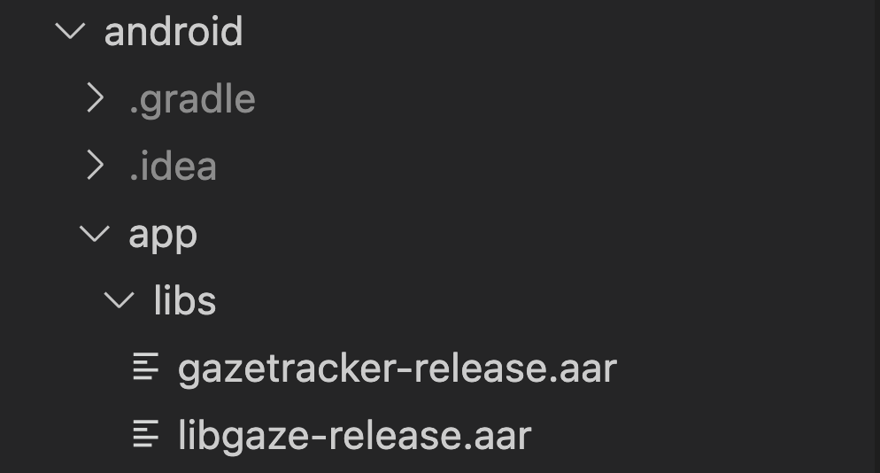
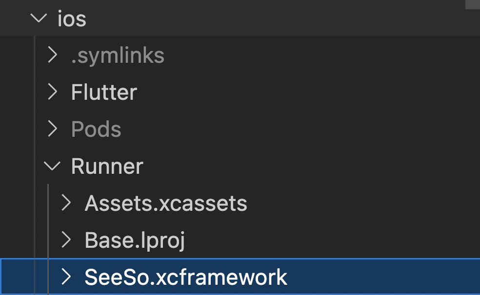

<p align="center">
    
</p>
<div align="center">
    <h1>SeeSo Flutter Sample</h1>
</div>

A SeeSo Flutter project.

## SeeSo
SeeSo is an AI based eye tracking SDK which uses image from RGB camera to track where the user is looking.
Extra hardware is not required and you can start your development for free.
In 2021, SeeSo was recognized for its innovative technology and won GLOMO Award for Best Mobile Innovation for Connected Living!

## Supported platform
- Android
- iOS

## Platform-specific code
-  [Flutter description link](https://docs.flutter.dev/development/platform-integration/platform-channels)
-  Flutter : [gaze_tracker_provider.dart](lib/src/provider/gaze_tracker_provider.dart)
- Android : [`MainActivity.kt`](/android/app/src/main/kotlin/com/example/test_flutter/MainActivity.kt)
- iOS : [`AppDelegate.swift`](/ios/Runner/AppDelegate.swift)

## SeeSo API Docs
- [docs.seeso.io](https://docs.seeso.io/docs/api/android-api-docs)


## Setting License Key

* Get a license key from https://manage.seeso.io and copy your key to [`gaze_tracker_provider.dart`](lib/src/provider/gaze_tracker_provider.dart#L10)

  ```dart
  static const licenseKey =
      'input your key'; // Please enter the key value for development issued by the SeeSo.io
  ```

## How to run (Android)
1. Clone or download this project.
2. Run this command `flutter pub get` in terminal.
3. Move the `gazetracker-release.aar` and `libgaze-release.aar` files in the "android/app/libs" path.
  
4. run Android device.

## How to run (iOS)
1. Clone or download this project.
2. Run this command `flutter pub get` in terminal.
3. Move the `SeeSo.xcframework` file in the "ios/Runner" path.
  
4. run iOS device.

## Contact Us
If you have any problems, feel free to [contact us](https://seeso.io/Contact-Us) 